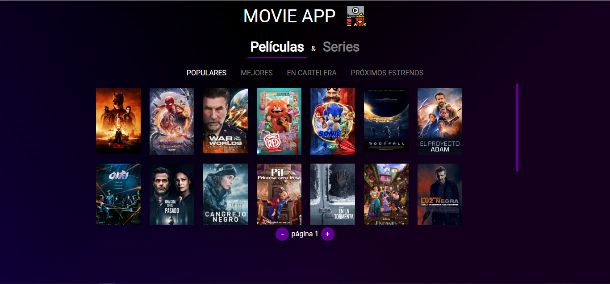

 
 # **Alan Fernández**
 ## :fire: *Desarrollador fullStack* :fire:
 ## :bell: Acerca de mí:
 Hola! soy Alan.   
 Desde el 2020 que estoy en el mundo de la programación web, siempre tratando de crecer en esta industria. Me apasiona la tecnología y por eso es que hoy estoy acá, en el mundo IT, buscando aportar y crecer dentro de proyectos que logren ser un reto para mi.   
 Espero poder trabajar junto a personas de las que pueda aprender.   
 > **información extra:** amante de los videojuegos :video_game: y los perritos :dog:
 ## :computer: Tecnologías que manejo:
|  frontend | backend  |  extra |
|---|---|---|
| :white_check_mark: Javascript  |  :white_check_mark: Node.js    |  :white_check_mark: Babel 
|:white_check_mark: css    | :white_check_mark: PostgreSQL  |  :white_check_mark: Git 
|:white_check_mark: HTML5      |  :white_check_mark: Mongodb   |   :white_check_mark: TDD(desarrollo de test)  
| :white_check_mark: React.js  |:white_check_mark: Sequelize  | :white_check_mark: Webpack  |     
| :white_check_mark: Redux| :white_check_mark: Express||           
          
 
 ## Experiencia laboral
Trabajé un año en el equipo de frontend de Hello Auto, empresa de seguros de autos.   
Mis tareas dentro de la empresa consistia en automatizar los procesos de creacion de póliza de seguro de auto a través de una web,trabajando con toda la información que el usuario aportaba a la plataforma.

## Proyectos
1. [MovieApp](https://movies-series-p2bkbzbo6-fernandezalan.vercel.app/):  

App de peliculas y series, en la que puedes ver información de las peliculas y series más populares y otras categorías.   
La app cuenta con:
  - la vista principal: una colección de las peliculas o series.
  - detalles de la pelicula o serie: al seleccionar un titulo se puede visualizar todos los detalles de este.
  - biografía de actores: puedes encontrar la biografía de los actores que participaron en el título seleccionado.   

Está app usa la api [The movie db](https://developers.themoviedb.org/3/getting-started/introduction/) para obtener la informacion de las peliculas y series.   
La app es una SPA(single web aplication) creada con React.   

<!---
fernandezAlan/fernandezAlan is a ✨ special ✨ repository because its `README.md` (this file) appears on your GitHub profile.
You can click the Preview link to take a look at your changes.
--->
